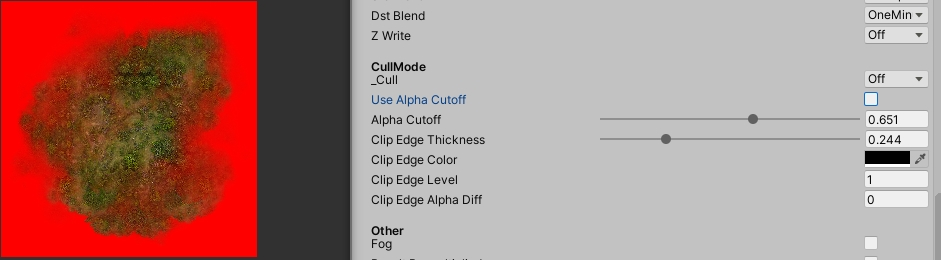
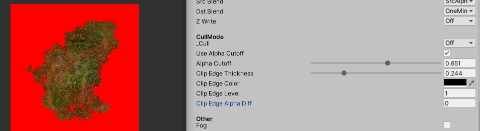
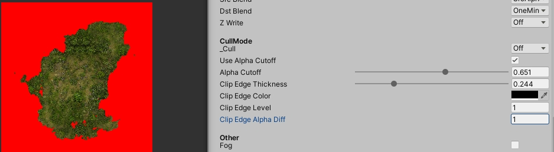
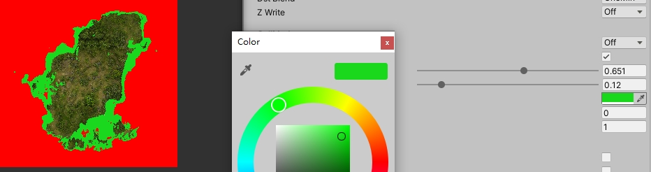

# 溶解边缘效果

## 参数

* Use Alpha Cutoff
  * 需要勾选, 以开启Alpha剔除, 以保证溶解效果的实现前提
* Alpha Cutoff
  * 设置值 以 将不透明度小于改值的渲染结果剔除
* Clip Edge Thickmess
  * 设置值 以指定 不透明度值在 [(Alpha Cutoff), (Alpha Cutoff) + (Clip Edge Thickmess)] 区间的渲染结果作为溶解的边缘
* Clip Edge Color
  * 指定 溶解边缘的渲染 使用的颜色参数
* Clip Edge Level
  * 指定 溶解边缘处源渲染结果的缩放值
* Clip Edge Alpha Diff
  * 指定 溶解边缘处 不透明度值的 增加量

## 边缘处渲染公式

* 颜色
  * 源渲染结果rgb * (Clip Edge Level) + (Clip Edge Color)
* 不透明度
  * 源渲染结果alpha + (Clip Edge Alpha Diff)

## 使用案例

### 案例 0

* 不启用边缘溶解
* 

### 案例 1

* Clip Edge Color 为 纯黑色
* Clip Edge Level 为 1
* Clip Edge Alpha Diff 为 0
* 结果
  * 边缘处渲染和源渲染没有区别
* 

### 案例 2

* Clip Edge Color 为 纯黑色
* Clip Edge Level 为 1
* Clip Edge Alpha Diff 为 1
* 结果
  * 边缘处渲染rgb 和 源渲染rgb 没有区别
  * alpha 则变为不小于 1, 即为1
* 

### 案例 3

* Clip Edge Color 为 任意颜色
* Clip Edge Level 为 0
* Clip Edge Alpha Diff 为 1
* 结果
  * 边缘处渲染rgb 和 源渲染rgb 完全无关, 完全对应 (Clip Edge Color)
  * alpha 则变为不小于 1, 即为1
* 
