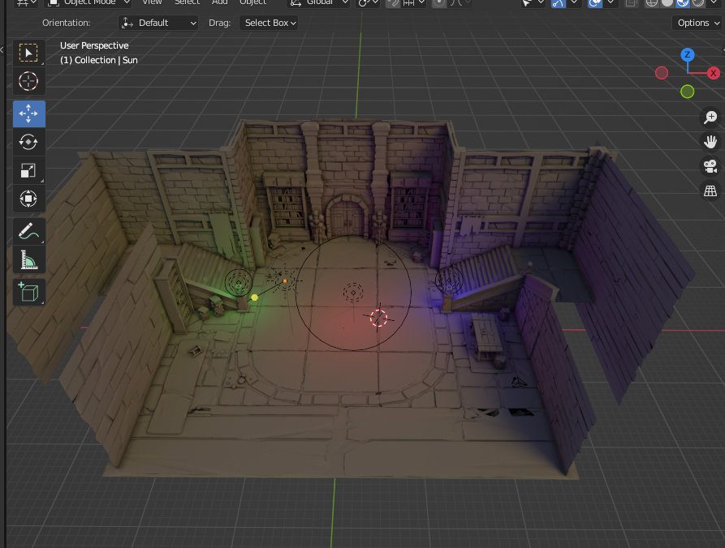

# Blender 烘培

## 烘培光照图

### 场景搭建

* 导入 网格
* 创建灯光

### 网格处理

* Object Mode 选择所有需要烘培的模型
  * Ctrl + J 合并
* 切换 Edit Mode
* 开新的视口
  * 切换 UV Editor
  * 新建 Image
* Edit Mode
  * A 全选顶点
  * U 打开快捷菜单
    * 选择 Smart UV Project
      * 设置参数确认
* 开新的视口
  * 切换 Shader Editor
    * 添加 AO 块
    * 添加 Diffuse BSDF 块
      * 链接 AO 块 和 Diffuse BSDF 块
    * 添加 Material Ouput 块 (如果打开时有了，就不用再创建)
      * 链接 Diffuse BSDF 块 和 Material Ouput 块
    * 添加 Image Texture 块
      * 选择创建的光照图
* Edit Mode 视口 切换到 Object Mode 视口
  * 选中要烘培的模型
* 转到 Propertiies 视口
  * 切换 Render Propertiies 菜单项
    * Render Engine 切换 Cycles
    * 转 Bake 选项
      * 点击 Bake

### 效果查看

* 烘培结束, 转到 Object Mode 视口
  * 在该视口右上角选择渲染模式
    * Wireframe 网格
    * Solid 模型
    * Material Preview 材质效果预览
    * Rendered 渲染结果

## Demo 结果

* 