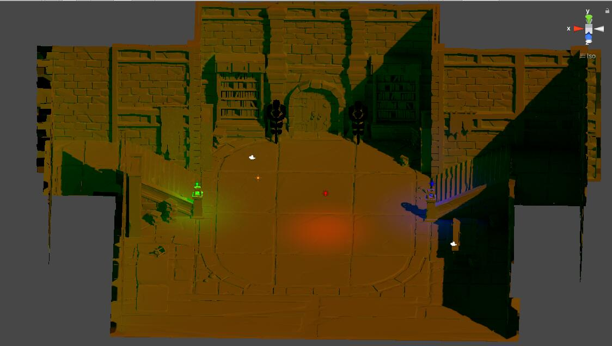

# Unity 烘培

## 烘培光照图

### 准备工作

* 模型预处理
  * 如果模型网格没有准备专门的光照图UV
    * 选中 fbx , 转到 Inspector 面板, 修改 Import Settings
      * ‘Generate Lightingmap UVs’ 勾选, Apply 应用 保存
      * 再去浏览网格时应当能看到网格具有 uv 和 uv2 数据
* 烘培场景搭建
  * 渲染层级问题
    * 需要将烘培物件单独归一个层级
  * 设定静态内容
    * 光照
    * 节点
  * 设定光照信息
    * Mode
      * Bake
    * Intensity
    * Shadow Type
    * Render Layer Mask
  * 设定 Mesh 渲染的光照相关信息
    * Cast Shadows
    * Receive Shadows
* 环境光照设置
  * 原理
    * 烘培时不能让环境光照影响烘培结果
      * 此处为运行时项目需求,如果时个人作品表现是可以把所有光照都进行烘培的
    * 因为烘培光照图用到项目中只作为静态光照的预处理结果来使用
      * 减少运行时实时光照计算
      * 运行环境中的环境光照并不是静态的，因此环境光照还会参与渲染运算
  * 操作
    * Lighting > Setting
      * Environment
        * Skybox Material 为 None
          * 不受天空盒影响
        * Sun Source 为 None
          * 不受场景设置的太阳光照影响
        * Environment Lighting
          * Source 选  Color
          * Ambient Color 设置 黑色
            * 不受环境光照影响
        * Environment Reflections
          * Intensity Multiplier 设置为 0
            * 不受反射影响
      * Lightmapping Settings
        * Lightmap Size 最大设置 2048
        * Compress Lightmaps 取消勾选
          * 不压缩光照图数据
        * Directional Mode 选择 Non-Directional
          * 只烘培光照图,不烘培其他数据
    * 其他操作无要求

### 效果问题

* 相比 Blender
  * 没有实时效果预览
  * 烘培时间更长
* Unity 光照烘培使用的是 内部的光线路径跟踪烘培
  * 渲染效果与实时渲染使用的材质球效果是有差异的

## Demo 结果

* 